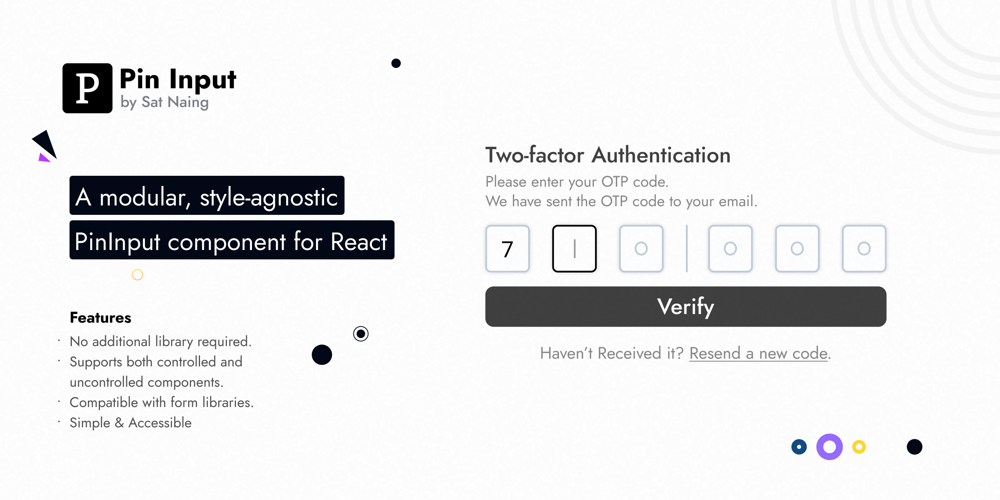

# Pin Input (React)

A modular, style-agnostic PinInput component for React, ready to use with just a copy-paste—no extra libraries needed.



## Features

- No additional library required.
- Supports both controlled and uncontrolled components.
- Compatible with form libraries.
- Simple & Accessible\_ support copy-paste, mask, auto-focus, onComplete, onIncomplete etc

## Get Started

1. Copy & paste [pin-input.tsx](src/components/ui/pin-input.tsx) into your project.
2. Use the component as needed, refering to the usage section for guidance.
3. That's it—enjoy the simplicity!

## Note

> You don’t need to install a component or CSS library. However, feel free to use one to enhance and customize the component to your needs.

## Usage

### Controlled PinInput

```tsx
function ControlledPinInput() {
  const [pinInput, setPinInput] = useState("");

  return (
    <PinInput
      className="flex h-10 space-x-4"
      value={pinInput}
      onChange={setPinInput}
      onComplete={(str) => console.log("completed", str)}
    >
      {Array.from({ length: 4 }, (_, i) => (
        <PinInputField key={i} component={Input} />
      ))}
    </PinInput>
  );
}
```

### Uncontrolled PinInput

```tsx
function ControlledPinInput() {
  return (
    <PinInput
      className="flex h-10 space-x-4"
      defaultValue=""
      onComplete={(str) => console.log("completed", str)}
      autoFocus
    >
      <PinInputField component={Input} />
      <PinInputField component={Input} />
      <Separator orientation="vertical" />
      <PinInputField component={Input} />
      <PinInputField component={Input} />
    </PinInput>
  );
}
```

### React-hook-form with Zod

```tsx
import { z } from "zod";
import { useState } from "react";
import { useForm } from "react-hook-form";
import { zodResolver } from "@hookform/resolvers/zod";
import { cn } from "@/lib/utils";
import {
  Form,
  FormControl,
  FormField,
  FormItem,
  FormMessage,
} from "@/components/ui/form";
import { Input } from "@/components/ui/input";
import { Button } from "@/components/ui/button";
import { Separator } from "@/components/ui/separator";
import { PinInput, PinInputField } from "@/components/ui/pin-input";

const formSchema = z.object({
  otp: z.string().min(1, { message: "Please enter your otp code." }),
});

export default function MyComponent() {
  const [isLoading, setIsLoading] = useState(false);
  const [disabledBtn, setDisabledBtn] = useState(true);

  const form = useForm<z.infer<typeof formSchema>>({
    resolver: zodResolver(formSchema),
    defaultValues: { otp: "" },
  });

  function onSubmit(data: z.infer<typeof formSchema>) {
    setIsLoading(true);
    console.log({ data });

    setTimeout(() => {
      form.reset();
      setIsLoading(false);
    }, 2000);
  }

  return (
    <Form {...form}>
      <form onSubmit={form.handleSubmit(onSubmit)}>
        <div className="grid gap-2">
          <FormField
            control={form.control}
            name="otp"
            render={({ field }) => (
              <FormItem className="space-y-1">
                <FormControl>
                  <PinInput
                    {...field}
                    className="flex h-10 md:h-14 justify-between"
                    onComplete={() => setDisabledBtn(false)}
                    onIncomplete={() => setDisabledBtn(true)}
                    placeholder="◯"
                  >
                    {Array.from({ length: 7 }, (_, i) => {
                      if (i === 3)
                        return <Separator key={i} orientation="vertical" />;
                      return (
                        <PinInputField
                          key={i}
                          component={Input}
                          className={cn(
                            "size-10 md:size-14 text-base md:text-lg",
                            form.getFieldState("otp").invalid &&
                              "border-red-500"
                          )}
                        />
                      );
                    })}
                  </PinInput>
                </FormControl>
                <FormMessage />
              </FormItem>
            )}
          />
          <Button
            size="lg"
            className="mt-2 h-8 md:h-10 md:text-lg md:py-5"
            disabled={disabledBtn}
            loading={isLoading}
          >
            Verify
          </Button>
        </div>
      </form>
    </Form>
  );
}
```

## Examples

- [PinInput (ShadcnUI + React Hook Form)](https://stackblitz.com/edit/pin-input-shadcn-react-hook-form?file=src%2FApp.tsx)
- [PinInput Raw (Controlled)](https://stackblitz.com/edit/pin-input-raw?file=src%2FApp.tsx)
- [PinInput Raw (Uncontrolled)](https://stackblitz.com/edit/pin-input-raw-uncontolled?file=src%2FApp.tsx)

## Author

Crafted with 🤍 by [Sat Naing](https://satnaing.dev). The design of the website is inspired by [https://time.openstatus.dev](https://time.openstatus.dev)

## License

Licensed under the [MIT License](https://choosealicense.com/licenses/mit/)
